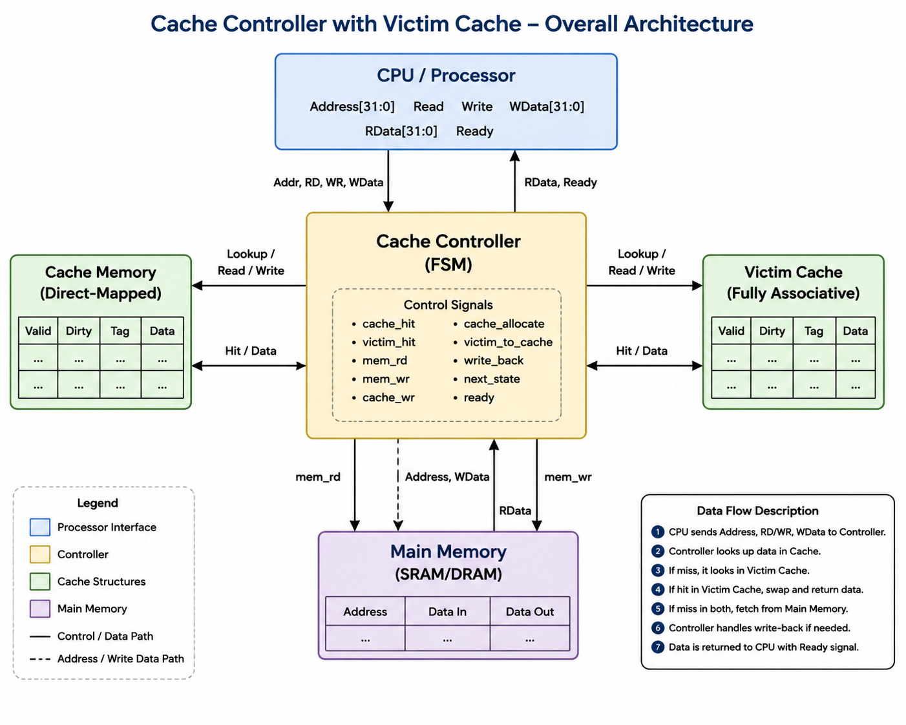
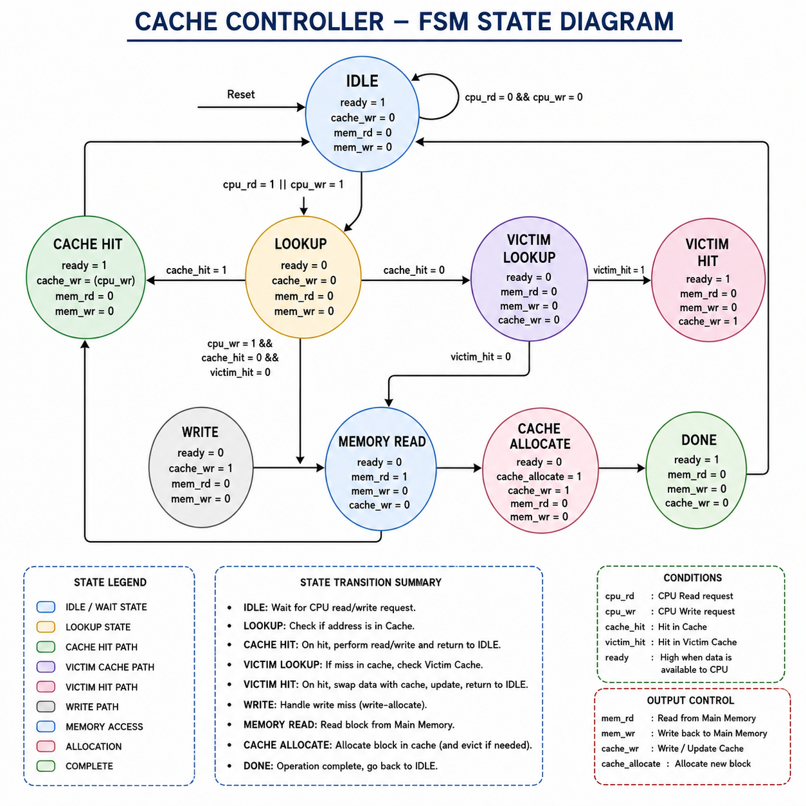
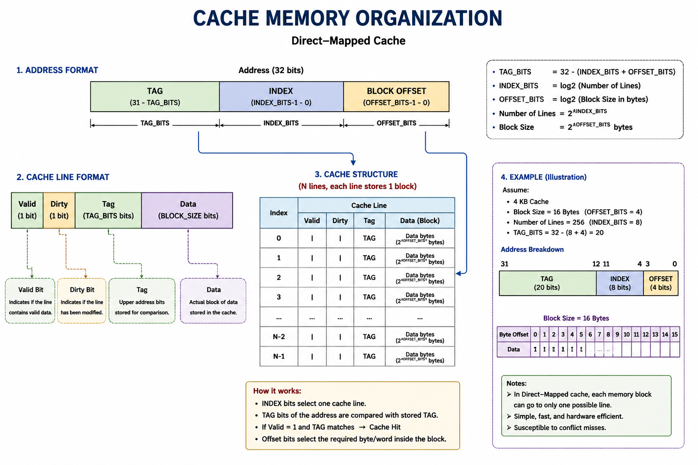
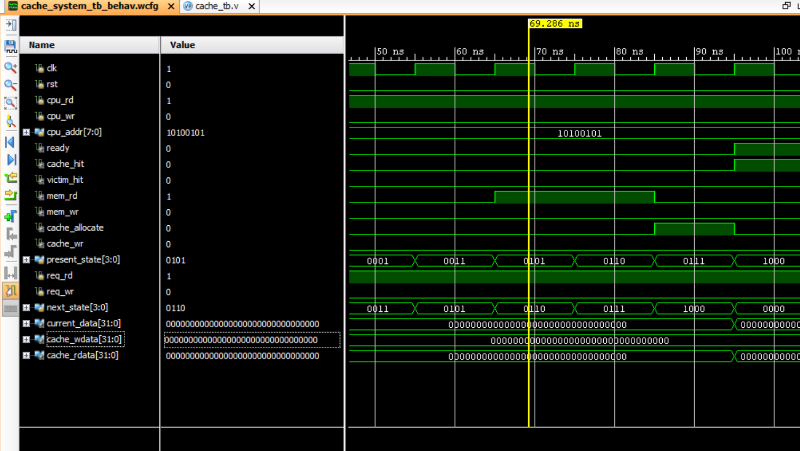
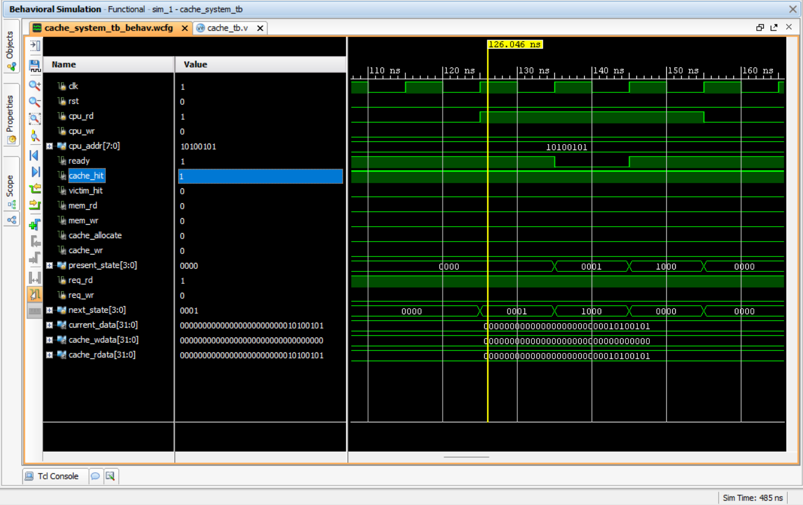
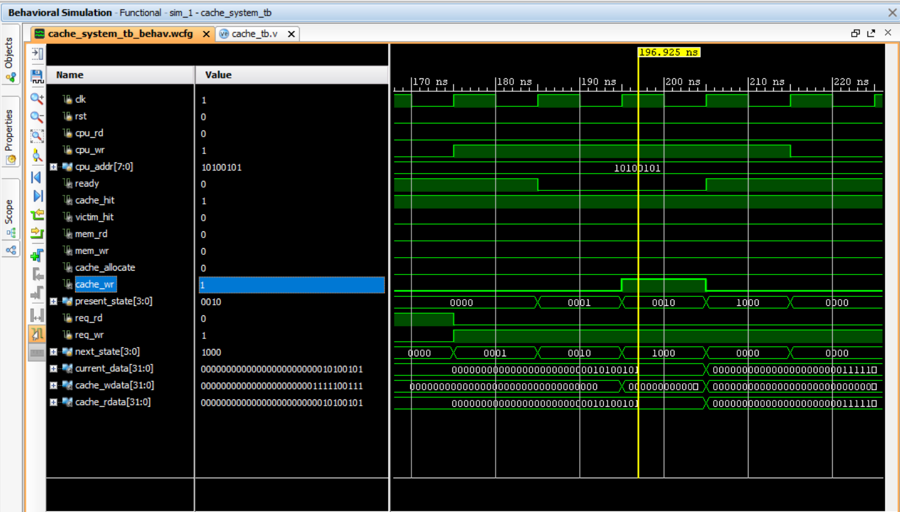
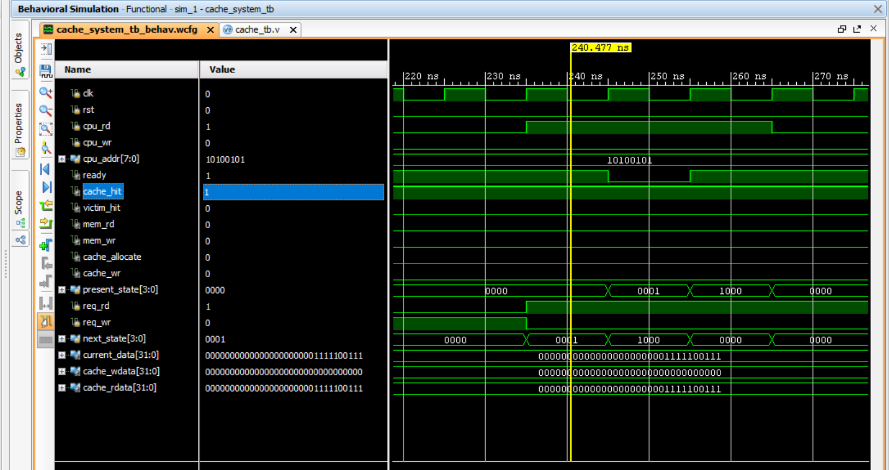
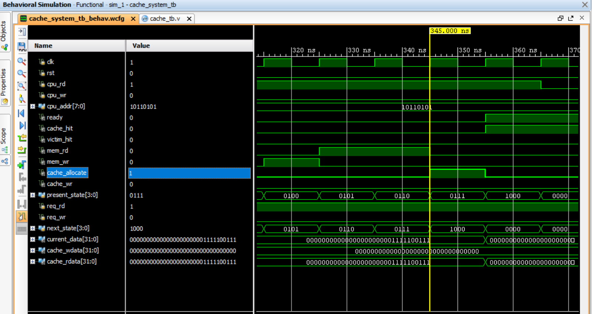
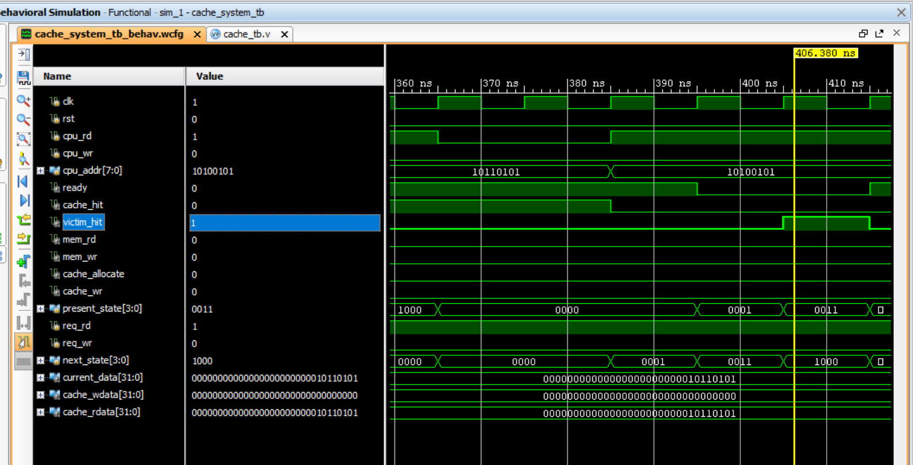

# Cache Controller with Victim Cache (Verilog HDL)

A parameterized Cache Controller designed in Verilog HDL that implements a Direct-Mapped Cache with an additional Victim Cache to reduce conflict misses and improve cache hit performance. The controller is implemented using a Finite State Machine (FSM) and supports cache hits, cache misses, victim cache lookup, cache allocation, write operations, and main memory access.

The project was developed and verified in **Xilinx Vivado 2014.1** using behavioral simulation.

---

## Key Features

- Direct-Mapped Cache Architecture
- Victim Cache for Conflict Miss Reduction
- FSM-Based Cache Controller
- Cache Hit & Cache Miss Handling
- Victim Cache Lookup
- Cache Line Allocation
- Write-Back Support
- Performance Monitoring
- Parameterized Verilog Design
- Comprehensive Testbench
---

# Overall Architecture

<p align="center">
  
</p>

The cache controller communicates with the CPU, Cache Memory, Victim Cache, and Main Memory. It controls cache lookup, victim cache lookup, cache allocation, memory read/write operations, and data transfer using an FSM.

---

# Cache Controller FSM

<p align="center">
  
</p>

The controller operates through multiple states to handle cache hits, cache misses, victim cache accesses, write-back operations, and cache allocation.

---

# Cache Memory Organization

<p align="center">
  
</p>

The cache uses a Direct-Mapped organization where each cache line stores:

- Valid Bit
- Dirty Bit
- Tag
- Data Block

The Victim Cache stores recently evicted cache lines to reduce conflict misses.
---

# Repository Structure

```text
cache-controller-with-victim-cache-verilog
│
├── src
│   ├── cache_controller.v
│   ├── cache_memory.v
│   ├── cache_top.v
│   ├── main_memory.v
│   ├── victim_cache.v
│   └── performance_monitor.v
│
├── tb
│   └── cache_system_tb.v
│
├── images
│
├── waveforms
│
├── docs
│
├── simulation
│
├── README.md
├── LICENSE
└── .gitignore
```
---

# RTL Modules

| Module | Description |
|---------|-------------|
| cache_controller.v | FSM-based controller that manages cache operations, memory access, and victim cache interaction. |
| cache_memory.v | Implements a parameterized direct-mapped cache with valid bits, dirty bits, tag storage, and data storage. |
| victim_cache.v | Stores recently evicted cache lines to reduce conflict misses. |
| main_memory.v | Behavioral main memory model used during simulation. |
| performance_monitor.v | Counts cache hits, misses, victim cache hits, reads, writes, and memory accesses. |
| cache_top.v | Integrates all modules into the complete cache system. |
---

# Testbench

The project includes a comprehensive behavioral testbench that verifies:

- Cache Miss
- Cache Hit
- Write Hit
- Verify Write
- Cache Replacement
- Victim Cache Lookup

The testbench automatically drives CPU read and write transactions and verifies the correctness of the cache controller.
---

# Simulation Results

The following test cases were successfully verified.

## Test 1 – Cache Miss

<p align="center">
  
</p>

---

## Test 2 – Cache Hit

<p align="center">
  
</p>

---

## Test 3 – Write Hit

<p align="center">
  
</p>

---

## Test 4 – Verify Write

<p align="center">
  
</p>

---

## Test 5 – Cache Replacement

<p align="center">
  
</p>

---

## Test 6 – Victim Cache Lookup

<p align="center">
  
</p>
---

# Working Principle

The Cache Controller receives read and write requests from the CPU and determines whether the requested data is available in the cache.

### Cache Hit
- Tag comparison succeeds.
- Data is returned directly from the cache.
- No main memory access is required.

### Cache Miss
- The requested data is not available in the cache.
- The controller checks the Victim Cache.
- If the data is not found, the controller accesses Main Memory.
- The fetched data is allocated into the cache.

### Write Operation
- On a write hit, the cache line is updated.
- The Dirty Bit is set.
- Modified data is written back to Main Memory only when the cache line is replaced (Write-Back Policy).

### Victim Cache
- Recently evicted cache lines are stored in the Victim Cache.
- If the CPU requests an evicted block, it can be retrieved without accessing Main Memory.
- This reduces conflict misses and improves performance.
---

# Performance Features

The design includes a performance monitor that records:

- Cache Hits
- Cache Misses
- Victim Cache Hits
- CPU Read Operations
- CPU Write Operations
- Main Memory Accesses

These counters help evaluate cache efficiency during simulation.
---

# How to Run

1. Open the project in Xilinx Vivado 2014.1.
2. Set `cache_system_tb.v` as the simulation top module.
3. Run **Behavioral Simulation**.
4. Observe the waveform and console output.
5. Verify the following test cases:

- Cache Miss
- Cache Hit
- Write Hit
- Verify Write
- Cache Replacement
- Victim Cache Lookup
---

# Future Improvements

- 2-Way Set Associative Cache
- LRU Replacement Policy
- Configurable Cache Line Size
- Multi-Level Cache Hierarchy (L1/L2)
- AXI Bus Interface
- Burst Memory Transfers
- ECC (Error Correction Code)
- Synthesizable FPGA Implementation
---

# Skills Demonstrated

- Verilog HDL
- Finite State Machine (FSM) Design
- Cache Memory Architecture
- Victim Cache Design
- Write-Back Cache Policy
- Parameterized RTL Design
- Behavioral Simulation
- Digital System Verification
- Performance Monitoring
- Xilinx Vivado